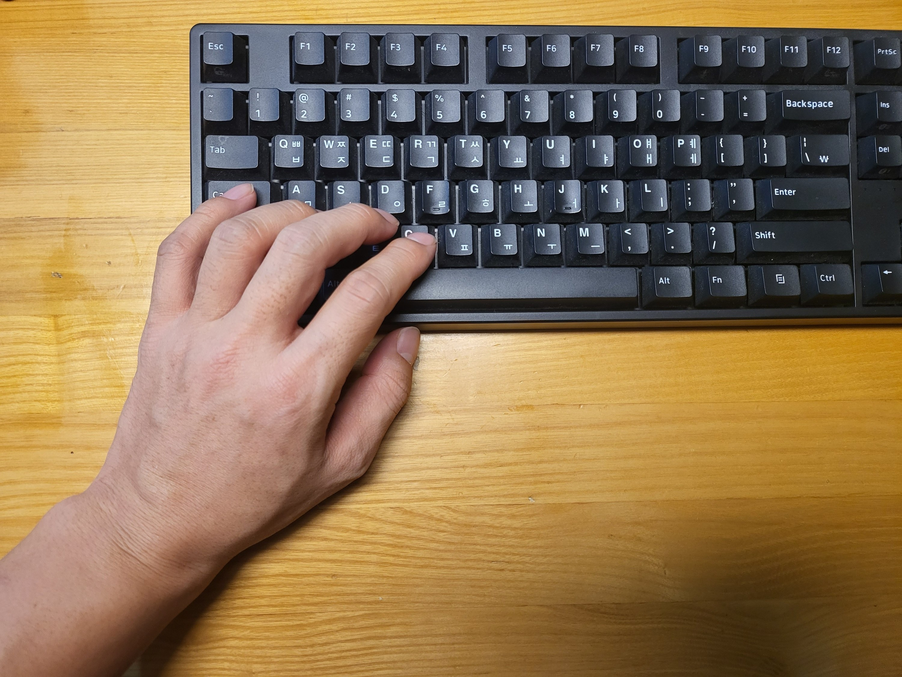
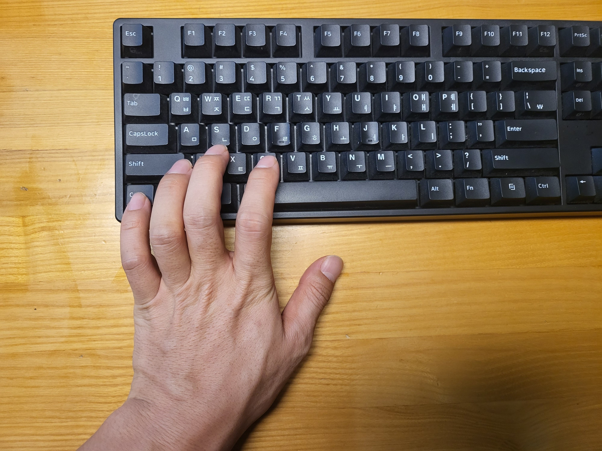

키보드중에서 가장 사용하지 않는 키는 무엇일까? 나는 단연 capslock인 것 같다. 어떻게 보면 가장 동선이 좋은 위치에 (오른쪽의 enter와 같은 위치) 있으면서 잘 쓰지 않는 비효율의 극치라고 생각한다.

## Capslock을 Ctrl로 바꿔야 하는 이유
내가 capslock을 ctrl로 바꿔 사용하게 된 계기가 있다. 동료와 함께 일을 하던 중 잠시 내에게 키보드를 넘겨 주었는데 엄청 당황했다. 그 키보는 해피해킹이라는 브랜드의 키보드로 키보드 배열이 우리가 흔히 사용하는 키보드와는 많이 다르다. 있어야 할 것이 많이 없다. ctrl이 있어야 하는 곳은 뻥 뚤려 있다. 이렇게나 비용을 절감 했을 듯 하지만 가격은 어마어마 하니 좀 아이러니하다.

무언가 불편해 보이는 이 키보드를 왜 쓰는걸까? 궁금해서 물어보니 편하단다. 자신은 다른 키보드를 못쓴다는데 그 이유는 한번 키보드위에서 손의 동선이 가장 효율적이기 때문이라고 했다. 특히 ctrl의 사용에 대해 장황히 설명을 해 주었다.

## `Ctrl + C` vs. `Capslock + C`
자그럼 여기서 한번 어떤 점이 효율적인지 한번 살펴 보자. ctrl은 단독으로 사용되지 않는다. 보통 다른 키와 함께 같이 눌리게 되는데 이때 왼쪽 가장 끝에 있는 ctrl을 누른채 다른키 누르기 위해서는 손목이 기역자 처럼 꺽이게 된다. 예를 들어 copy를 하기 위해 ctrl+c ctrl+v를 한다고 했을 경우 타이핑을 하다가 손목을 기역자로 꺽어서 ctrl+c 한뒤 다시 손목을 원상태로 풀어 다시 타이핑을 한다. 누가 이렇게 하냐고 물을 수 있지만.. 지금 바로 해 보시라. 진짜 그러고 있다. 해본 김에 반대로 capslock을 ctrl이라 생각하고 복사 단축키를 눌러 보면 얼마나 불편하게 사용하고 있는지 느껴질 것이다.

|capslock|ctrl|
|:---|:---|
|||

## 결론 
그러니 지금 당장 당신의 쓸모없는 capslock을 ctrl로 바꾸길 추천한다! 아마도 일년에 ctrl+c를 누를 횟수만큼 더 빠르 손목을 건강히 사용할수 있을 것이다.

내가 당당히 바꾸라 외쳤지만... 고백하건데 단점이 하나 있다. 내 PC를 사용하는 동안에는 더할 나위 없이 만족하면서 쓰겠지만, 내 pc가 아닌 환경에서는 자꾸 대문자로 변환된 영문이 썼다 지웠다를 반복하게 될 것이다. 새로운 매번 바꿔주는 것도 일이다.

